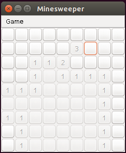

# minesweeper
A simple minesweeper in Java Swing. Inspired by 'Mines' in Simon Tatham's Portable Puzzle Collection.

Generate *.jar file with

    jar cvfe Minesweeper.jar com.iamam34.minesweeper.MinesweeperGui -C bin .

And run it with

    java -jar Minesweeper.jar

Possible improvements (feel free to diy):
* prettier graphics (ie. icons instead of text on buttons)
* highscore table
* optimised discovery algorithm -- I feel like I need to click more squares manually than I ought to.
* more obvious 'freeze' at game over (win/lose)
* exciting game-over notification (win/lose)
* smarter board generation
* configurable board size/number of mines

